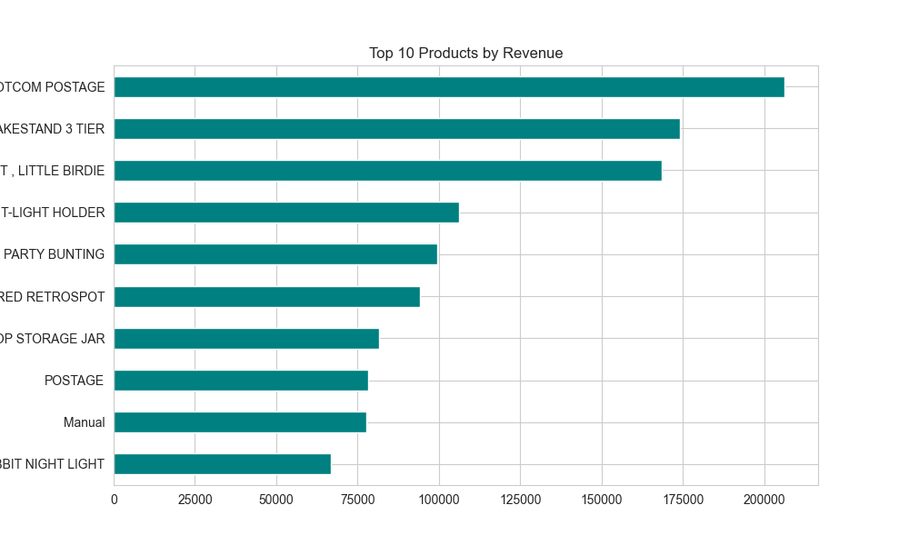
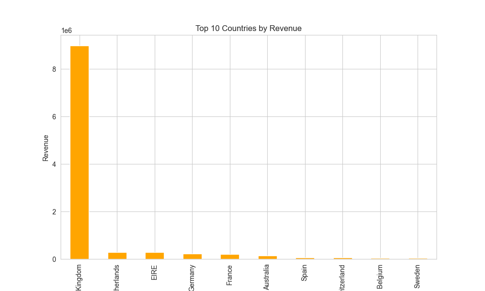
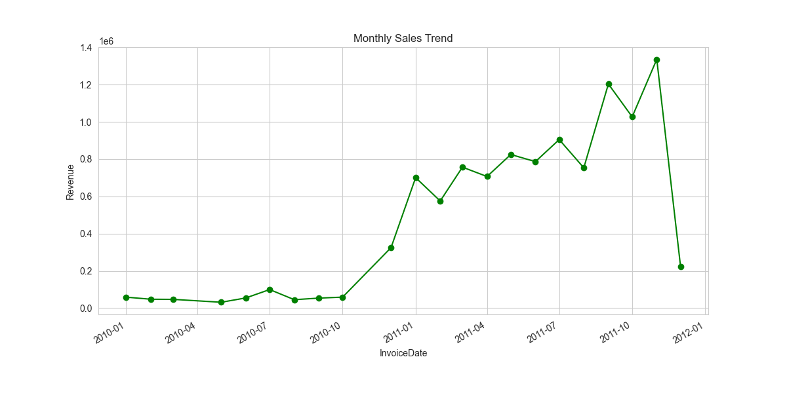

# 01 – Retail Sales Analysis

**Objective:**  
Analyze retail sales data to uncover trends, top products, and high-performing countries.

**Dataset:**  
- Source: Kaggle – Online Retail dataset  

**Skills Demonstrated:**  
- Data Cleaning & Deduplication  
- Exploratory Data Analysis (EDA)  
- KPI Calculation  
- Visualization & Trend Analysis  

**Key Results:**  
- Total Revenue, Total Orders, Average Order Value (see reports/kpis.txt)  
- Top 10 Products:   
- Top 10 Countries:   
- Monthly Sales Trend:   

**Project Structure:**
```
01-retail-sales-analysis/
├── data/online_retail.csv
├── notebooks/retail_sales_analysis.ipynb
├── reports/
│   ├── kpis.txt
│   ├── top_products.png
│   ├── top_countries.png
│   └── monthly_sales.png
└── README.md
```
